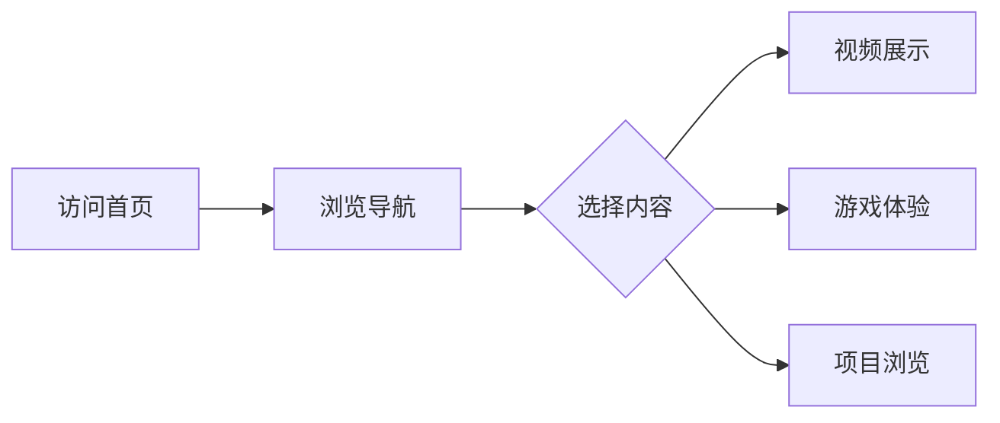

## 1. Product Overview
一个高级交互式作品集网页，用于整合AI通识课的各类作业，支持视频展示、Ren'Py游戏嵌入、项目展示等多种内容形式，具有丰富的交互性和趣味性。

## 2. Core Features

### 2.1 User Roles
| Role | Registration Method | Core Permissions |
|------|---------------------|------------------|
| Visitor | None | Browse all content, interact with games |

### 2.2 Feature Module
1. **首页**: 英雄区域、导航、作品概览卡片
2. **视频展示区**: 支持内嵌视频播放、自定义播放器控件
3. **游戏展示区**: Ren'Py游戏嵌入展示，可直接游玩
4. **项目作品集**: 各类作业项目展示，支持分类筛选
5. **关于页**: 个人介绍、课程信息

### 2.3 Page Details
| Page Name | Module Name | Feature description |
|-----------|-------------|---------------------|
| Home | Hero Section | 动态背景动画、渐变效果、标题展示 |
| Home | Navigation | 平滑滚动导航、响应式菜单 |
| Home | Video Gallery | 视频卡片网格、悬浮预览、模态框播放 |
| Home | Game Showcase | Ren'Py游戏iframe嵌入、游戏控制按钮 |
| Home | Projects | 项目卡片瀑布流、分类标签筛选 |
| Home | Interactive Elements | 鼠标跟随效果、粒子背景、动画过渡 |

## 3. Core Process
用户访问首页 -> 浏览导航 -> 选择感兴趣的内容区域 -> 观看视频/玩游戏/查看项目 -> 流畅的页面滚动体验

## 4. User Interface Design

### 4.1 Design Style
- **主题色**: 深邃蓝紫色系 (#1a1a2e, #16213e, #0f3460, #e94560)
- **按钮风格**: 圆角、渐变、悬停动画效果
- **字体**: 现代无衬线字体，标题使用渐变效果
- **布局**: 响应式网格布局，卡片式设计
- **图标**: 现代简约风格

### 4.2 Page Design Overview
| Page Name | Module Name | UI Elements |
|-----------|-------------|-------------|
| Home | Hero | 动态粒子背景、渐变文字、CTA按钮 |
| Home | Video Gallery | 视频缩略图卡片、悬浮放大效果、播放按钮覆盖层 |
| Home | Game Showcase | 游戏嵌入容器、全屏切换、音量控制 |
| Home | Projects | 分类标签栏、项目卡片、悬停信息展示 |
| Home | Footer | 社交链接、版权信息、动态效果 |

### 4.3 Responsiveness
- 桌面端: 多列网格布局
- 平板端: 中等列数自适应
- 移动端: 单列布局，汉堡菜单

### 4.4 Animation Effects
- 页面加载动画
- 平滑滚动
- 卡片悬停效果
- 元素进入视口动画
- 鼠标跟随粒子效果
