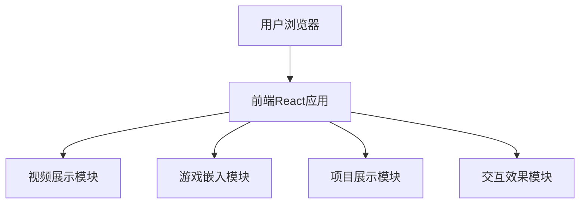

## 1. Architecture Design



## 2. Technology Description

* Frontend: React\@18 + TypeScript + tailwindcss\@3 + vite

* Initialization Tool: vite-init

* Backend: None (纯前端项目)

* Animation: CSS Animations + Framer Motion

## 3. Route Definitions

| Route | Purpose     |
| ----- | ----------- |
| /     | 首页，包含所有内容区域 |

## 4. Component Structure

```
src/
├── components/
│   ├── Hero.tsx          # 英雄区域组件
│   ├── Navigation.tsx    # 导航组件
│   ├── VideoGallery.tsx  # 视频展示组件
│   ├── GameShowcase.tsx  # 游戏展示组件
│   ├── ProjectGrid.tsx   # 项目网格组件
│   ├── ParticleBackground.tsx  # 粒子背景组件
│   └── Footer.tsx        # 页脚组件
├── data/
│   └── mockData.ts       # 模拟数据
├── App.tsx
└── main.tsx
```

## 5. Data Model

### 5.1 Video Item

```typescript
interface VideoItem {
  id: string;
  title: string;
  description: string;
  thumbnail: string;
  videoUrl: string;
  category: string;
}
```

### 5.2 Game Item

```typescript
interface GameItem {
  id: string;
  title: string;
  description: string;
  coverImage: string;
  gameUrl: string;
}
```

### 5.3 Project Item

```typescript
interface ProjectItem {
  id: string;
  title: string;
  description: string;
  category: string;
  image: string;
  tags: string[];
}
```

